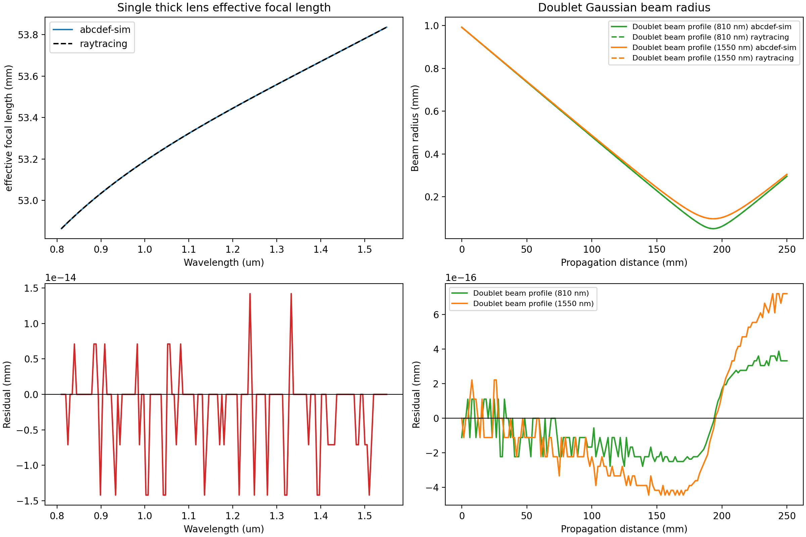

## abcdef-sim
`abcdef-sim` is an **architecture-first simulation scaffold** for frequency-dependent ray-transfer (ABCDEF) optics on top of `phys-pipeline`.

> Current state: the repository includes validated data models, pipeline assembly, Martinez-aligned stage propagation, and pure-data result synthesis helpers.

## What is implemented today

- Immutable, validated input models:
  - `SystemPreset` / `OpticSpec`
  - `LaserSpec`
- Runtime state model:
  - `RayState`
- Optic abstraction and factory:
  - `Optic` base class
  - `FreeSpace` optic
  - `OpticFactory.default()` registry
- Stage config generation:
  - `OpticStageCfgGenerator`
  - optional two-level cfg cache (`L1` grid + `L2` per-omega)
- Pipeline assembly:
  - `SystemAssembler.build_optic_cfgs(...)`
  - `SystemAssembler.build_pipeline(...)`
  - `AbcdefOpticStage` wrapper stages
- Stage physics + result synthesis:
  - `physics.abcdef.adapters.apply_cfg(...)`
  - `physics.abcdef.compute_pipeline_result(...)`

## What is intentionally not implemented yet

- Additional optic implementations (e.g., `Grating` builder is stubbed/not registered).
- Stage-result caching at pipeline execution level.

## Pure physics layer and validation

New additive pure-physics modules live under:
- `src/abcdef_sim/physics/abcd` for paraxial ABCD transfer math (matrices, rays, Gaussian q propagation).
- `src/abcdef_sim/physics/abcdef` for structured ABCDEF conventions, Martinez phase helpers, batched propagation kernels, and pure-data pipeline result synthesis.

Martinez phase bookkeeping is stored in radians. The per-optic `phi3_rad` term uses the post-element displacement sign already validated in `tests/physics/test_martinez_phase_terms.py`.

To run reference validation tests against the external `raytracing` package:

```bash
pip install -e '.[validation]'
pytest tests/physics/test_abcd_against_raytracing.py
```

If `raytracing` is not installed, the validation test module is skipped.

To generate the canonical comparison figure and wavelength-scaling benchmark report:

```bash
python examples/compare_thick_lens_to_raytracing.py
```

This writes:

- `artifacts/physics/thick_lens_similarity.png`
- `artifacts/physics/wavelength_tracking_benchmarks.md`

The legacy plot-only wrapper still works:

```bash
python scripts/generate_abcd_validation_plot.py
```

For the checked-in figure, benchmark sample table, and scope notes about what is and is not
validated against `raytracing`, see `docs/raytracing-validation.md`.




## Running tests by marker

Use pytest markers to select the right validation depth for your change:

```bash
# all tests
pytest -q

# fast gate (exclude runtime-heavy tests)
pytest -m "not slow" -q

# physics validation lane (oracle/analytical/regression)
pytest -m "physics" -q

# quick physics checks only
pytest -m "physics and not slow" -q
```

When to use each:
- `pytest -q`: full local confidence before merging.
- `pytest -m "not slow" -q`: fast feedback while iterating on most changes.
- `pytest -m "physics" -q`: validate optical transfer behavior against physics checks and references.
- `pytest -m "physics and not slow" -q`: rapid physics sanity checks during refactors.
