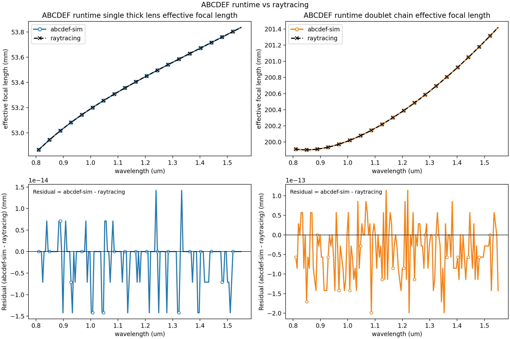

## abcdef-sim
`abcdef-sim` is an **architecture-first simulation scaffold** for frequency-dependent ray-transfer (ABCDEF) optics on top of `phys-pipeline`.

> Current state: the repository includes validated data models, pipeline assembly, Martinez-aligned stage propagation, and pure-data result synthesis helpers.

## What is implemented today

- Immutable, validated input models:
  - `SystemPreset` / `OpticSpec`
  - `LaserSpec`
- Runtime state model:
  - `RayState`
- Optic abstraction and factory:
  - `Optic` base class
  - `FreeSpace` optic
  - `OpticFactory.default()` registry
- Stage config generation:
  - `OpticStageCfgGenerator`
  - optional two-level cfg cache (`L1` grid + `L2` per-omega)
- Pipeline assembly:
  - `SystemAssembler.build_optic_cfgs(...)`
  - `SystemAssembler.build_pipeline(...)`
  - `AbcdefOpticStage` wrapper stages
- Stage physics + result synthesis:
  - `physics.abcdef.adapters.apply_cfg(...)`
  - `physics.abcdef.compute_pipeline_result(...)`

## What is intentionally not implemented yet

- Additional optic implementations (e.g., `Grating` builder is stubbed/not registered).
- Stage-result caching at pipeline execution level.

## Pure physics layer and validation

New additive pure-physics modules live under:
- `src/abcdef_sim/physics/abcd` for paraxial ABCD transfer math (matrices, rays, Gaussian q propagation).
- `src/abcdef_sim/physics/abcdef` for structured ABCDEF conventions, Martinez phase helpers, batched propagation kernels, and pure-data pipeline result synthesis.

Martinez phase bookkeeping is stored in radians. The per-optic `phi3_rad` term uses the post-element displacement sign already validated in `tests/physics/test_martinez_phase_terms.py`.

To run reference validation tests against the external `raytracing` package:

```bash
pip install -e '.[validation]'
pytest tests/physics/test_abcd_against_raytracing.py
```

If `raytracing` is not installed, the validation test module is skipped.

To generate the canonical comparison figure and wavelength-scaling benchmark report:

```bash
python examples/compare_thick_lens_to_raytracing.py
```

This writes:

- `artifacts/physics/abcdef_runtime_similarity.png`
- `artifacts/physics/abcd_helper_similarity.png`
- `artifacts/physics/abcdef_runtime_wavelength_tracking_benchmarks.md`

The legacy plot-only wrapper still works:

```bash
python scripts/generate_abcd_validation_plot.py
```

That wrapper generates only the lower-level ABCD helper validation figure, not the full ABCDEF runtime
figure.

For the checked-in figure, benchmark sample table, and scope notes about what is and is not
validated against `raytracing`, see `docs/raytracing-validation.md`.

Primary runtime snapshot (`ABCDEF runtime` vs `raytracing`):



To generate the Treacy compressor validation and benchmarking artifacts:

```bash
python scripts/generate_treacy_benchmark_artifacts.py
```

This writes deterministic JSON/PNG artifacts to `artifacts/physics/`:

- `treacy_radius_convergence.json`
- `treacy_radius_convergence.png`
- `treacy_radius_mirror_heatmap.json`
- `treacy_radius_mirror_heatmap.png`
- `treacy_spatial_metrics_vs_radius.json`
- `treacy_spatial_metrics_vs_radius.png`
- `treacy_spatial_metrics_vs_radius_mirror.json`
- `treacy_spatial_metrics_vs_radius_mirror.png`
- `treacy_output_plane_spatiospectral.json`
- `treacy_output_plane_spatiospectral.png`

The artifacts are split into one primary error-comparison figure and several
explicitly labeled full-ABCDEF companion plots.

- Primary matched-comparison error heatmap:
  - `treacy_radius_mirror_heatmap.png`
  - shows full-ABCDEF relative error against the analytic plane-wave Treacy
    baseline for GDD and TOD over beam radius and `length_to_mirror`
  - the JSON includes the analytic reference values and the exact relative-error
    definition used in the plot
  - the default mirror-leg sweep uses larger geometric steps from `0` up to
    `1.6e6 um` so mirror-distance trends remain visible on the same log-scaled
    error map
- Full-ABCDEF scalar error plot:
  - `treacy_radius_convergence.png`
  - uses relative error against the analytic Treacy baseline at
    `length_to_mirror = 0`
- Full-ABCDEF spatial companion plots:
  - `treacy_spatial_metrics_vs_radius.png`
  - `treacy_spatial_metrics_vs_radius_mirror.png`
- Output-plane reconstruction:
  - `treacy_output_plane_spatiospectral.png`
  - shows only the full ABCDEF reconstruction

The local Treacy analytic model remains the scalar reference. Public benchmark
artifacts now report only the full ABCDEF comparison; the old `without_phi2`
diagnostic is not part of the generated benchmark figures or JSON payloads.

The current Treacy preset resolves the second-grating and return-pass center
incidence angles against the laser center wavelength at runtime. It also uses
explicit reflected-frame `x' -> -x'` handoffs after each grating interaction
plus an explicit fold-frame handoff at the mirror instead of modeling the
return leg as a single synthetic `2L` free-space segment. This correction is
what restores the expected single-pass angular-dispersion cancellation and
brings the large-beam full ABCDEF Treacy benchmark back toward the scalar
analytic limit.


## Running tests by marker

Use pytest markers to select the right validation depth for your change:

```bash
# all tests
pytest -q

# fast gate (exclude runtime-heavy tests)
pytest -m "not slow" -q

# physics validation lane (oracle/analytical/regression)
pytest -m "physics" -q

# quick physics checks only
pytest -m "physics and not slow" -q
```

When to use each:
- `pytest -q`: full local confidence before merging.
- `pytest -m "not slow" -q`: fast feedback while iterating on most changes.
- `pytest -m "physics" -q`: validate optical transfer behavior against physics checks and references.
- `pytest -m "physics and not slow" -q`: rapid physics sanity checks during refactors.
