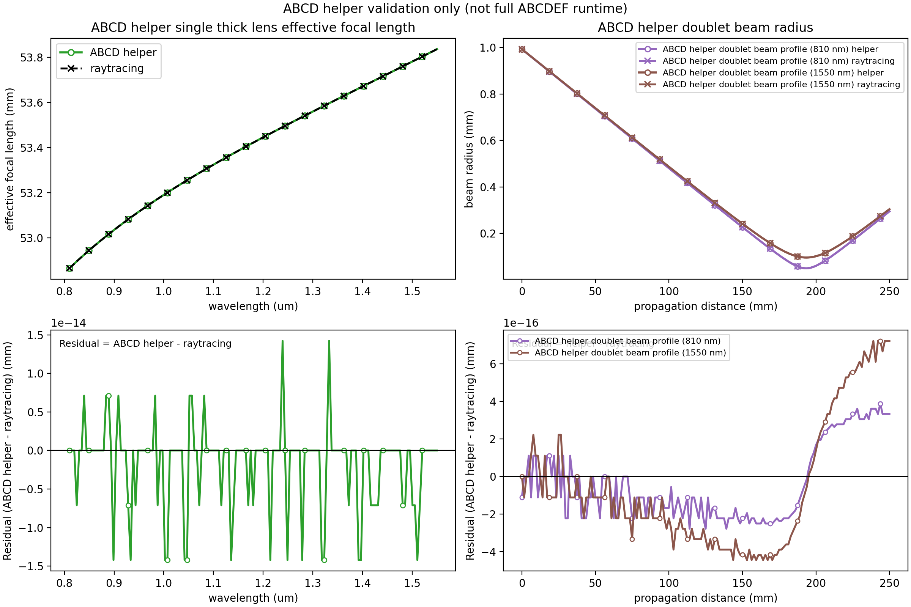

# raytracing-backed thick lens validation

This document separates two different validation layers that both compare against the external
`raytracing` package:

- **ABCDEF runtime validation**: the runtime `ThickLens.matrix(...)` plus batched
  `physics.abcdef.propagation.propagate_step(...)` path
- **ABCD helper validation**: lower-level helper functions in `physics/abcd/*`

Only the **ABCDEF runtime** path is used for the checked-in performance benchmarks.

## Setup

Install the optional validation dependencies:

```bash
pip install -e '.[validation]'
```

Run the canonical example:

```bash
python examples/compare_thick_lens_to_raytracing.py
```

That writes:

- `artifacts/physics/abcdef_runtime_similarity.png`
- `artifacts/physics/abcd_helper_similarity.png`
- `artifacts/physics/abcdef_runtime_wavelength_tracking_benchmarks.md`

The legacy plot-only wrapper remains available:

```bash
python scripts/generate_abcd_validation_plot.py
```

That wrapper generates only the **ABCD helper** figure.

## ABCDEF runtime validation

This is the primary, repo-facing validation story. It compares the runtime thick-lens implementation
that emits Martinez-form ABCDEF matrices against `raytracing`.

The checked-in runtime figure below shows:

- `ABCDEF runtime single thick lens effective focal length` versus wavelength
- `ABCDEF runtime doublet chain effective focal length` versus wavelength
- residuals defined explicitly as `abcdef-sim - raytracing`

The overlay styling is backend-specific even when the curves nearly coincide:

- `abcdef-sim`: solid lines with open-circle markers
- `raytracing`: dashed lines with `x` markers


## ABCDEF runtime benchmark methodology

The benchmark report is **runtime only**. It does not claim anything about the lower-level ABCD
helper functions.

- Wavelength counts: `1, 8, 32, 128, 512`
- Warmup runs per case: `2`
- Measured runs per case: `5`
- Metric: median wall-clock time from `time.perf_counter`
- Local path:
  - runtime `ThickLens.matrix(...)` generation
  - batched Martinez-form propagation via `propagate_step(...)`
- Reference path:
  - scalar `raytracing` element construction and scalar ray propagation loop

## Sample ABCDEF runtime benchmark table

These timings are machine-dependent and are committed only as one sample run from the maintained
validation environment.

Sample run captured on March 8, 2026 in the `wust-gnlse` conda environment:

| Scenario | Wavelengths | abcdef-sim (ms) | raytracing (ms) | Speedup |
| --- | ---: | ---: | ---: | ---: |
| ABCDEF runtime single thick lens ray trace | 1 | 0.397 | 0.389 | 0.98x |
| ABCDEF runtime doublet chain ray trace | 1 | 0.658 | 0.440 | 0.67x |
| ABCDEF runtime single thick lens ray trace | 8 | 0.996 | 1.063 | 1.07x |
| ABCDEF runtime doublet chain ray trace | 8 | 1.496 | 3.979 | 2.66x |
| ABCDEF runtime single thick lens ray trace | 32 | 2.064 | 4.386 | 2.12x |
| ABCDEF runtime doublet chain ray trace | 32 | 4.316 | 13.235 | 3.07x |
| ABCDEF runtime single thick lens ray trace | 128 | 8.973 | 42.975 | 4.79x |
| ABCDEF runtime doublet chain ray trace | 128 | 20.443 | 67.938 | 3.32x |
| ABCDEF runtime single thick lens ray trace | 512 | 27.094 | 145.835 | 5.38x |
| ABCDEF runtime doublet chain ray trace | 512 | 64.036 | 266.802 | 4.17x |

## ABCD helper validation

The helper figure below is intentionally retained because it is still useful lower-level evidence for
the optics helper layer. It is **not** the full ABCDEF runtime/stage path and should not be used for
runtime performance claims.

The helper figure shows:

- `ABCD helper single thick lens effective focal length`
- `ABCD helper doublet beam profile`
- residuals against `raytracing`



The comparison still does **not** attempt to validate Martinez phase bookkeeping. The external
`raytracing` package is only used here as an oracle for shared paraxial spatial-transfer and Gaussian
beam observables.
